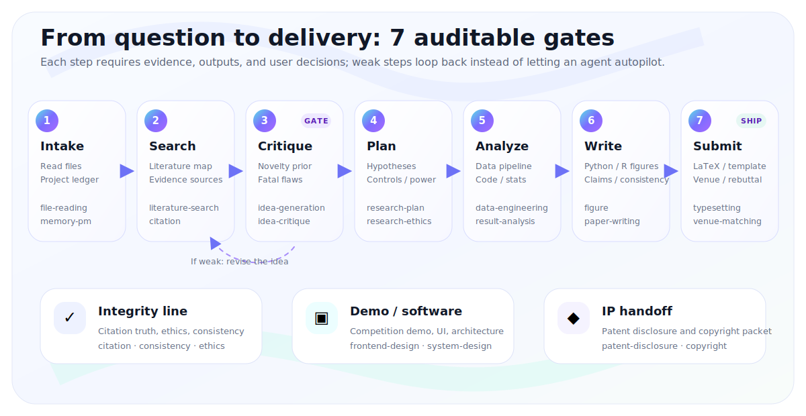

<div align="center">


# Light Skills

**An AI workflow skill pack for research, competitions, and innovation projects**

<p align="center">
  <a href="LICENSE"></a>
  
  
  
  <br/>
  
  
</p>

<p><a href="README.md">简体中文</a> · <strong>English</strong></p>

</div>

---

## What can it help you do?

Light Skills is a public, domain-agnostic skill pack for turning a research or innovation project from a vague idea into auditable deliverables.

| Your situation | What Light Skills helps with |
|---|---|
| I only have a topic | Ask clarifying questions, define constraints, and break the project into stages |
| I have an idea but do not know whether it is new | Search related work, split target/background, find collisions and reviewer attacks |
| I need experiments or data analysis | Design data flow, experiment matrix, scripts, tests, result analysis, and robustness checks |
| I need an English paper | Structure the story, figures, citations, LaTeX typesetting, and pre-submission checks |
| I need scientific figures | Generate Python/R figures programmatically with size, typography, and honesty checks |
| I need a demo or competition interface | Design frontend demos, system structure, interactions, and presentation material |
| I need patent or software copyright material | Draft disclosure materials, technical schemes, embodiments, and document lists |
| I need to continue across chats | Keep a project ledger of goals, decisions, artifacts, unverified claims, and next steps |

## Why it fits research projects

- **Read before writing**: inspect files, data, logs, and paper sources before making claims.
- **Mark unknowns honestly**: facts, DOI, links, venue rules, and software versions are checked instead of guessed.
- **Generate reproducible figures**: paper, data, and experiment figures are produced with Python/R code.
- **Ask at decision points**: topic choice, novelty, evidence strength, venue target, and further investment need user confirmation.
- **No private knowledge base required**: the public package does not require MCP or a local database; current facts are checked at task time.

## Install

Enter the repository:

```powershell
git clone https://github.com/Light0305/Light-skills.git
cd Light-skills
$env:PYTHONUTF8="1"
```

### Codex

```powershell
# Project-level: $REPO\.agents\skills
$env:PYTHONUTF8="1"
python scripts\bootstrap_agent_skills.py --targets agents --mode auto --force

# Global: $HOME\.agents\skills
New-Item -ItemType Directory -Force "$HOME\.agents\skills" | Out-Null
Copy-Item -Recurse -Force .\skills\* "$HOME\.agents\skills\"
```

### Claude Code

```powershell
# Project-level: $REPO\.claude\skills\<skill>\SKILL.md
$env:PYTHONUTF8="1"
python scripts\bootstrap_agent_skills.py --targets claude --mode auto --force

# Global: $HOME\.claude\skills
New-Item -ItemType Directory -Force "$HOME\.claude\skills" | Out-Null
Copy-Item -Recurse -Force .\skills\* "$HOME\.claude\skills\"
```

### OpenCode

```powershell
# Project-level: $REPO\.opencode\skills\<skill>\SKILL.md
$env:PYTHONUTF8="1"
python scripts\bootstrap_agent_skills.py --targets opencode --mode auto --force

# Global: $HOME\.config\opencode\skills
New-Item -ItemType Directory -Force "$HOME\.config\opencode\skills" | Out-Null
Copy-Item -Recurse -Force .\skills\* "$HOME\.config\opencode\skills\"
```

Check the installation:

```powershell
$env:PYTHONUTF8="1"
python scripts\bootstrap_agent_skills.py --check-only
```

## Environment

### Base

- Git
- Python 3.10+
- On Windows, set `$env:PYTHONUTF8="1"` before running Python scripts.

### LaTeX

```powershell
winget install --id MiKTeX.MiKTeX --accept-package-agreements --accept-source-agreements
latexmk -v
pdflatex --version
xelatex --version
biber --version
```

Use this for paper typesetting, PDF compilation, and template checks. `light-typesetting` supports `latexmk`, pdfLaTeX, XeLaTeX, LuaLaTeX, BibTeX, and Biber. If a tool is missing, it reports `UNAVAILABLE` instead of pretending that a PDF was delivered.

### R

```powershell
winget install --id RProject.R --accept-package-agreements --accept-source-agreements
Rscript -e "install.packages(c('ggplot2','scales'), repos='https://cloud.r-project.org')"
$env:PYTHONUTF8="1"
python skills\light-figure\scripts\r_ggplot.py --detect
```

Use this for ggplot2 scientific figures. If R is missing, the figure skill should ask whether to continue with a Python fallback or install/configure R.

## Start from your current state

| Current state | Suggested entry |
|---|---|
| Topic only | `/light-orchestrator I want to turn this direction into a submittable English paper. Ask necessary questions first, then propose stages, deliverables, risks, and decision gates.` |
| Existing idea | `$light-idea-critique Critique this idea: novelty, falsifiability, related work, strongest counterexamples, reviewer risks, and validation plan.` |
| Existing files | `$light-file-reading Read this project directory first. List key files, completed work, unverified claims, risks, and next steps.` |
| Literature search | `$light-literature-search Build a search strategy, keyword expansion, evidence map, and related-work boundary for this question.` |
| Experiment design | `$light-research-plan Give an experiment matrix, data needs, metrics, failure conditions, and minimum viable validation.` |
| Figures | `$light-figure Plan paper figures from these data. Require programmatic generation, reproducibility, colorblind-safe palettes, and clear labels.` |
| Paper writing | `$light-paper-writing Organize an English manuscript from existing evidence, with contributions, limitations, and self-review checks.` |
| Typesetting | `$light-typesetting Build and preflight the current LaTeX source, figures, BibTeX, and venue template.` |
| Interface/demo | `$light-frontend-design Design a demo page, component structure, interactions, and presentation focus for this research project.` |

## Skill map

| Module | Skills |
|---|---|
| Orchestration and continuity | `light-orchestrator`, `light-memory-pm`, `light-file-reading`, `light-project-structure` |
| Ideas and literature | `light-literature-search`, `light-idea-generation`, `light-idea-critique`, `light-research-plan` |
| Data and experiments | `light-data-engineering`, `light-experiment-coding`, `light-result-analysis` |
| Paper delivery | `light-paper-writing`, `light-citation`, `light-consistency`, `light-typesetting`, `light-venue-matching`, `light-review-rebuttal` |
| Figures and demos | `light-figure`, `light-frontend-design`, `light-system-design` |
| Integrity and IP | `light-research-ethics`, `light-patent-disclosure`, `light-software-copyright` |

## Complete skill catalog

| Skill | Main use | Typical outputs |
|---|---|---|
| [`light-orchestrator`](skills/light-orchestrator) | Main controller: understand the task, ask necessary questions, select the skill chain, and set user decision gates | Stage plan, skill routing, decision checkpoints, workflow ledger |
| [`light-memory-pm`](skills/light-memory-pm) | Project ledger and cross-session continuation without storing private memory in the public repository | Project card, handoff card, decision log, resume prompt |
| [`light-file-reading`](skills/light-file-reading) | Read papers, PDFs, Word files, slides, spreadsheets, images, and project files | File inventory, understanding notes, extraction-quality report, unverified-claim list |
| [`light-project-structure`](skills/light-project-structure) | Scaffold and govern research/software project directories for maintainability and reproducibility | Project scaffold, directory policy, governance rules, structure check |
| [`light-literature-search`](skills/light-literature-search) | Build search strategies, expand keywords, track evidence boundaries, and map related work | Search strings, evidence map, literature table, PRISMA-style flow record |
| [`light-idea-generation`](skills/light-idea-generation) | Generate candidate research ideas from literature gaps, cross-domain analogies, and constraints | Idea cards, gap evidence, genealogy analysis, candidate ranking |
| [`light-idea-critique`](skills/light-idea-critique) | Critique novelty, falsifiability, feasibility, and fatal flaws before committing to an idea | Go/no-go verdict, counterexample list, revision roadmap, novelty-evidence gate |
| [`light-research-plan`](skills/light-research-plan) | Convert a question into an executable study plan with hypotheses, variables, controls, and failure trees | Experiment matrix, preregistration draft, sample-size/power checks, reproducibility plan |
| [`light-research-ethics`](skills/light-research-ethics) | Check ethics, authority, consent, data boundaries, and research-integrity risks | Ethics risk table, authority lifecycle check, retraction/overlap/anomalous-text alerts |
| [`light-data-engineering`](skills/light-data-engineering) | Assess data identity, access, quality, splits, leakage, feasibility, and drift risks | Data card, quality gate, leakage check, feasibility report |
| [`light-experiment-coding`](skills/light-experiment-coding) | Build reproducible experiment code, configuration, tests, and run records | Experiment scaffold, config schema, seed audit, run manifest |
| [`light-result-analysis`](skills/light-result-analysis) | Run statistical analysis, method-compatibility checks, leakage/overfit checks, and result interpretation | Analysis report, statistical tests, method-compatibility check, result card |
| [`light-figure`](skills/light-figure) | Plan and generate paper/data figures programmatically, with Python and R support | Figure plan card, Python/R figures, export package, visual-honesty check |
| [`light-paper-writing`](skills/light-paper-writing) | Draft manuscript structure, argument chains, contributions, limitations, and self-review from existing evidence | IMRaD/conference draft, claim-evidence binding, self-review checklist, polished manuscript |
| [`light-citation`](skills/light-citation) | Verify citation truth, DOI, links, locators, and claim-citation binding | Citation registry, four-gate verification, suspicious-reference list, repair suggestions |
| [`light-consistency`](skills/light-consistency) | Check consistency across the paper, figures, slides, code, and supplementary materials | Glossary, fact bindings, metric/method locks, cross-material consistency report |
| [`light-typesetting`](skills/light-typesetting) | Typeset with LaTeX templates, compile PDFs, inspect logs, and preflight submissions | Compilable LaTeX/PDF, template adaptation, build log, submission-readiness check |
| [`light-venue-matching`](skills/light-venue-matching) | Match journals/conferences using topic fit, evidence, risk, and privacy constraints | Venue candidate table, fit ranking, risk notes, user-selection record |
| [`light-review-rebuttal`](skills/light-review-rebuttal) | Decompose reviews, plan extra experiments, manage commitments, and draft responses | Response matrix, commitment ledger, experiment-request gate, response letter |
| [`light-frontend-design`](skills/light-frontend-design) | Design interfaces, components, and presentation experiences for research projects, competitions, or software demos | Page structure, component plan, motion suggestions, accessibility/browser QA |
| [`light-system-design`](skills/light-system-design) | Design software architecture, APIs, data models, migrations, and readiness checks | Architecture package, OpenAPI/schema, migration strategy, design-readiness report |
| [`light-patent-disclosure`](skills/light-patent-disclosure) | Organize invention points, prior-art differences, and patent disclosure materials without replacing legal advice | Patent interview notes, search leads, disclosure evidence packet |
| [`light-software-copyright`](skills/light-software-copyright) | Prepare software-copyright materials, source-deposit planning, and completeness checks | Software-copyright packet, source-deposit plan, materials completeness check |

## Research workflow

Light Skills is not designed to let an agent blindly run the whole project end to end. It breaks research into auditable stages with explicit checkpoints, rollback paths, and user decisions.

<p align="center">
  
</p>

| Stage | What Light mainly does | Common skills |
|---|---|---|
| Intake and understanding | Read papers, tables, images, and project files; define task boundaries and maintain a project ledger | `file-reading`, `memory-pm`, `project-structure` |
| Novelty and ideas | Search literature, generate candidate ideas, and critique novelty, feasibility, and fatal flaws | `literature-search`, `idea-generation`, `idea-critique` |
| Research design | Specify hypotheses, variables, controls, sample size, failure trees, and reproducible study plans | `research-plan`, `research-ethics` |
| Data and experiments | Prepare data, check leakage and quality, implement experiments, and analyze results | `data-engineering`, `experiment-coding`, `result-analysis` |
| Paper delivery | Generate reproducible figures, write the manuscript, verify citations, check consistency, and typeset LaTeX | `figure`, `paper-writing`, `citation`, `consistency`, `typesetting` |
| Submission and IP | Match venues, prepare rebuttals, and organize patent or software-copyright materials | `venue-matching`, `review-rebuttal`, `patent-disclosure`, `software-copyright` |
| Demo and software | Add frontend demos and system design when a project, competition, or product needs an interface | `frontend-design`, `system-design` |

## Paper demo

A paper demo example in environmental chemistry / photocatalytic kinetics, showing the complete deliverable shape from synthetic data, analysis, programmatic figures, and LaTeX PDF.

<p align="center">
  <a href="projects/photocatalytic-dye-kinetics-study/paper/main.pdf">
    
  </a><br>
  <sub><a href="projects/photocatalytic-dye-kinetics-study/paper/main.pdf">Read PDF</a></sub>
</p>

## Figure gallery

The gallery below is generated with Python and R.

<p align="center">
  
</p>

## Feedback and support

- Email: 1833058953@qq.com
- GitHub: [@Light0305](https://github.com/Light0305)
- Issues, PRs, and usage feedback are welcome.

| WeChat donation | WeChat official account |
|:-:|:-:|
|  |  |

## License

This project is released under the [MIT License](LICENSE).

## Star history

[](https://www.star-history.com/#Light0305/Light-skills&Date)
