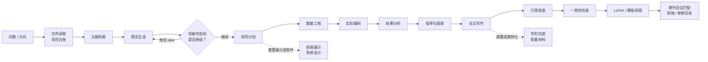
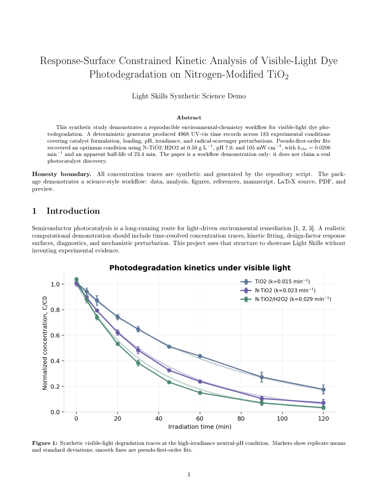
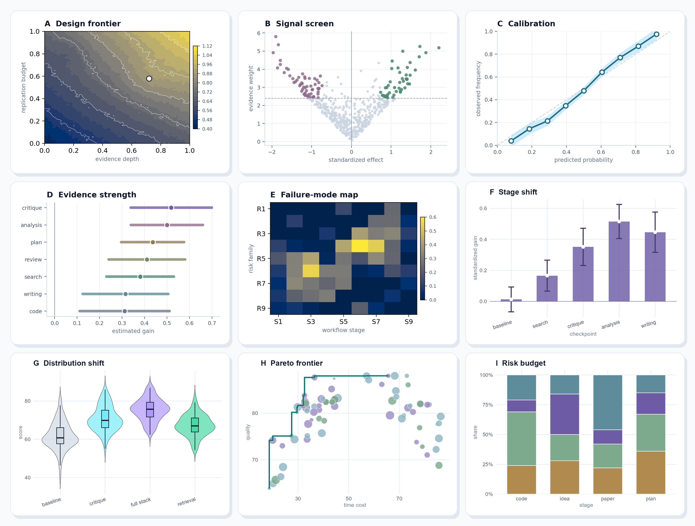
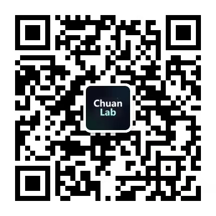

<div align="center">


# Light Skills

**面向科研、竞赛与创新项目的 AI 全流程技能包**

<p align="center">
  <a href="LICENSE"></a>
  
  
  
  <br/>
  
  
</p>

<p><strong>简体中文</strong> · <a href="README.en.md">English</a></p>

</div>

---

## 这个项目能帮你做什么？

Light Skills 是一套公开、通用、领域无关的 AI skill 包，用来把一个研究或创新项目从“模糊想法”推进到“可检查的交付物”。

它适合这些场景：

| 你现在的需求 | Light Skills 会怎么帮 |
|---|---|
| 我只有一个研究方向 | 追问目标、约束、数据来源和评价标准，再拆成阶段计划 |
| 我有一个 idea，但不知道新不新 | 检索相似工作、拆 target/background、找最强反例和审稿人攻击点 |
| 我要做实验/数据分析 | 设计数据流、实验矩阵、脚本、自测、结果解释和鲁棒性检查 |
| 我要写英文论文 | 组织故事线、图表、引用核查、LaTeX 排版、投稿前检查 |
| 我要画科研图 | 用 Python/R 程序化出图，检查尺寸、字号、色盲安全、视觉诚实 |
| 我要做竞赛/项目展示界面 | 设计 frontend demo、系统结构、交互页面和展示材料 |
| 我要准备专利/软著材料 | 生成交底书草案、技术方案、实施例、软著文档清单 |
| 我要跨对话继续项目 | 用项目台账记录目标、决策、产物、未验证声明和下一步 |

## 为什么适合科研项目？

- **先读再写**：先读文件、数据、日志和论文源，再判断下一步。
- **查不到就标 unknown**：事实、DOI、链接、期刊规则和软件版本不靠猜。
- **图表必须可复现**：论文图、数据图、实验图走 Python/R 程序化生成。
- **关键节点问用户**：选题、创新性、证据强度、投稿目标和继续投入都应有人确认。
- **不依赖私有知识库**：公开版不要求 MCP 或本地数据库；最新信息在任务现场核查。

## 先安装

先进入仓库目录：

```powershell
git clone https://github.com/Light0305/Light-skills.git
cd Light-skills
$env:PYTHONUTF8="1"
```

### Codex

```powershell
# 项目级：$REPO\.agents\skills
$env:PYTHONUTF8="1"
python scripts\bootstrap_agent_skills.py --targets agents --mode auto --force

# 全局级：$HOME\.agents\skills
New-Item -ItemType Directory -Force "$HOME\.agents\skills" | Out-Null
Copy-Item -Recurse -Force .\skills\* "$HOME\.agents\skills\"
```

### Claude Code

```powershell
# 项目级：$REPO\.claude\skills\<skill>\SKILL.md
$env:PYTHONUTF8="1"
python scripts\bootstrap_agent_skills.py --targets claude --mode auto --force

# 全局级：$HOME\.claude\skills
New-Item -ItemType Directory -Force "$HOME\.claude\skills" | Out-Null
Copy-Item -Recurse -Force .\skills\* "$HOME\.claude\skills\"
```

### OpenCode

```powershell
# 项目级：$REPO\.opencode\skills\<skill>\SKILL.md
$env:PYTHONUTF8="1"
python scripts\bootstrap_agent_skills.py --targets opencode --mode auto --force

# 全局级：$HOME\.config\opencode\skills
New-Item -ItemType Directory -Force "$HOME\.config\opencode\skills" | Out-Null
Copy-Item -Recurse -Force .\skills\* "$HOME\.config\opencode\skills\"
```

安装后检查：

```powershell
$env:PYTHONUTF8="1"
python scripts\bootstrap_agent_skills.py --check-only
```

## 环境要求

### 基础环境

- Git
- Python 3.10+
- Windows 上运行 Python 前建议设置：`$env:PYTHONUTF8="1"`

### LaTeX 环境

```powershell
winget install --id MiKTeX.MiKTeX --accept-package-agreements --accept-source-agreements
latexmk -v
pdflatex --version
xelatex --version
biber --version
```

用于论文排版、PDF 编译、模板检查。`light-typesetting` 支持 `latexmk`、pdfLaTeX、XeLaTeX、LuaLaTeX、BibTeX、Biber；如果本机缺工具，会标记 `UNAVAILABLE`，不会假装已经排版成功。

### R 环境

```powershell
winget install --id RProject.R --accept-package-agreements --accept-source-agreements
Rscript -e "install.packages(c('ggplot2','scales'), repos='https://cloud.r-project.org')"
$env:PYTHONUTF8="1"
python skills\light-figure\scripts\r_ggplot.py --detect
```

用于 ggplot2 科研图。没有 R 时，图表技能应先问你：继续用 Python 诚实降级，还是安装/配置 R。

## 从哪里开始？

你可以按当前状态直接复制下面的 prompt：

| 当前状态 | 建议入口 |
|---|---|
| 只有方向 | `/light-orchestrator 我想把这个方向做成可投稿英文论文。请先问必要问题，再拆阶段、产物、风险和用户确认点。` |
| 已有 idea | `$light-idea-critique 批判这个 idea：创新性、可证伪性、相似工作、最强反例、审稿人风险和验证路线。` |
| 已有项目文件 | `$light-file-reading 先读取这个项目目录，列出关键文件、已完成内容、未验证声明、风险和下一步。` |
| 要查文献 | `$light-literature-search 围绕这个问题做检索策略、关键词扩展、证据地图和相关工作边界。` |
| 要做实验 | `$light-research-plan 给出实验矩阵、数据需求、评价指标、失败条件和最小可行验证。` |
| 要画图 | `$light-figure 基于这些数据规划论文图，要求程序化生成、可复现、色盲安全、标注清楚。` |
| 要写论文 | `$light-paper-writing 根据已有证据组织英文论文结构、贡献、局限性和自审清单。` |
| 要排版投稿 | `$light-typesetting 基于当前 LaTeX 源、图、BibTeX 和期刊模板做可复现编译与投稿前检查。` |
| 要做界面 | `$light-frontend-design 为这个科研/竞赛项目设计 demo 页面、组件结构、交互和展示重点。` |

## 技能地图

| 模块 | 技能 |
|---|---|
| 总控与连续性 | `light-orchestrator`、`light-memory-pm`、`light-file-reading`、`light-project-structure` |
| 想法与文献 | `light-literature-search`、`light-idea-generation`、`light-idea-critique`、`light-research-plan` |
| 数据与实验 | `light-data-engineering`、`light-experiment-coding`、`light-result-analysis` |
| 论文交付 | `light-paper-writing`、`light-citation`、`light-consistency`、`light-typesetting`、`light-venue-matching`、`light-review-rebuttal` |
| 图表与展示 | `light-figure`、`light-frontend-design`、`light-system-design` |
| 诚信与成果转化 | `light-research-ethics`、`light-patent-disclosure`、`light-software-copyright` |

## 科研主线



## 论文 Demo 展示

一个论文Demo示例，方向是环境化学 / 光催化动力学，它展示了从合成数据、分析、程序化图表到 LaTeX PDF 的完整交付形态。

<p align="center">
  <a href="projects/photocatalytic-dye-kinetics-study/paper/main.pdf">
    
  </a><br>
  <sub><a href="projects/photocatalytic-dye-kinetics-study/paper/main.pdf">阅读 PDF</a> </sub>
</p>

## 图表展示

下面的九宫格科研图由 Python 与 R 生成。

<p align="center">
  
</p>


## 反馈与支持

- 邮箱：1833058953@qq.com
- GitHub：[@Light0305](https://github.com/Light0305)
- 欢迎 issue / PR / 使用反馈。

| 微信收款码 | 微信公众号 |
|:-:|:-:|
|  |  |

## Star 趋势

[](https://www.star-history.com/#Light0305/Light-skills&Date)

## 许可证

本项目使用 [MIT License](LICENSE)。
